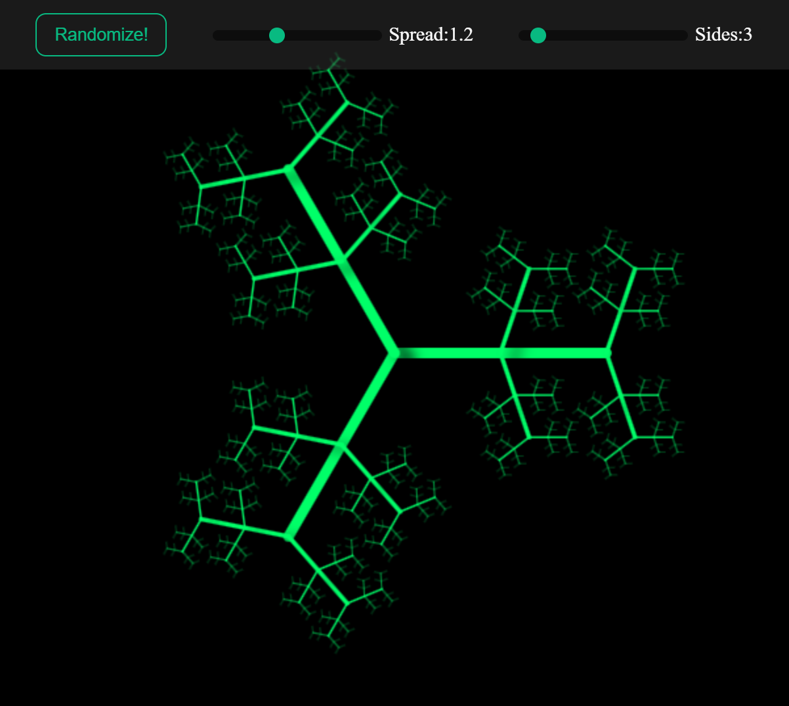

The project is live on Github Pages

# Generative Art
Using computers to generate art is the gist of what generative art is. In this project I tried to create one such system using recursion to generate some truly spectacular images.

# Description
Using recursion and parameters like depth, sides of the fractal, line width, spread of the branches of the fracal, scale between parent and child branches to create a fractal art. The next branch is drawn by drawing the current branch rotating by some amount and recursively drawing the branch, another branch opposite to the child branch is also drawn. The native *Canvas* of the browser is used for this project. No additional dependencies are used !

## Demo



## Features

- Changing the number of sides of the generated fractal.
- Changing the spread between the branches of the generated fractal.

## Run Locally for development

Clone the project

```bash
  git clone https://github.com/Sarath191181208/generative_art
```

Go to the project directory

```bash
  cd ./generative_art
```

open index.html

## Resources
- https://www.youtube.com/watch?v=dQKYao-daYw


## Authors

- [Sarath](https://www.github.com/https://github.com/Sarath191181208)
